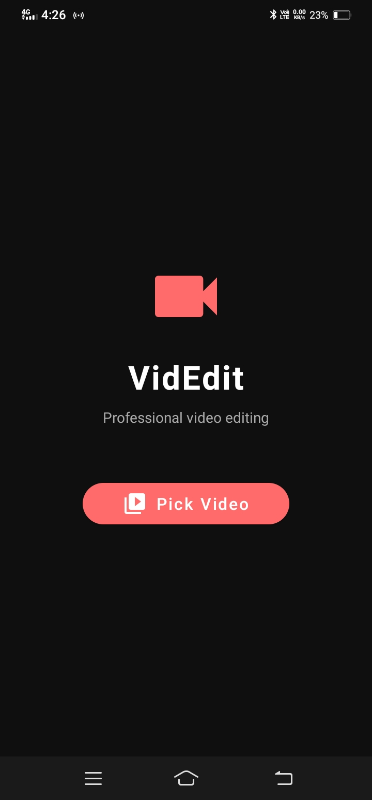
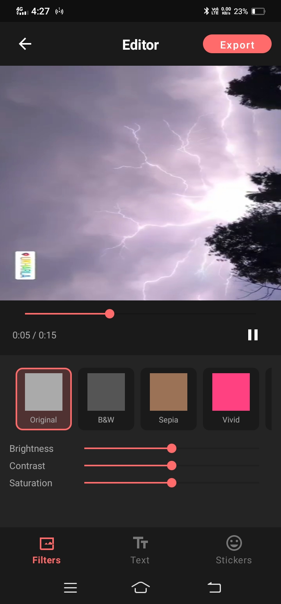
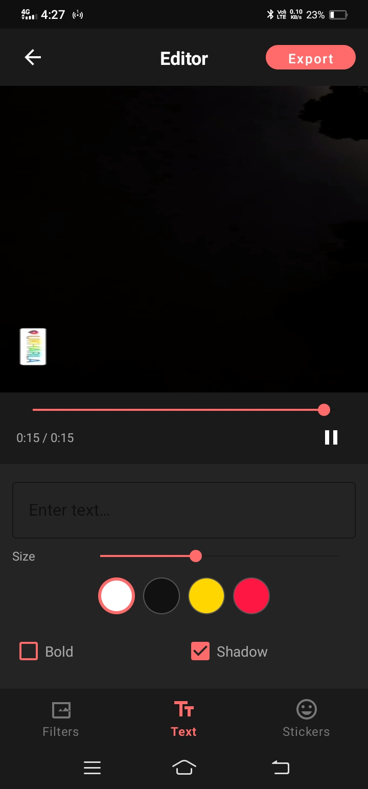
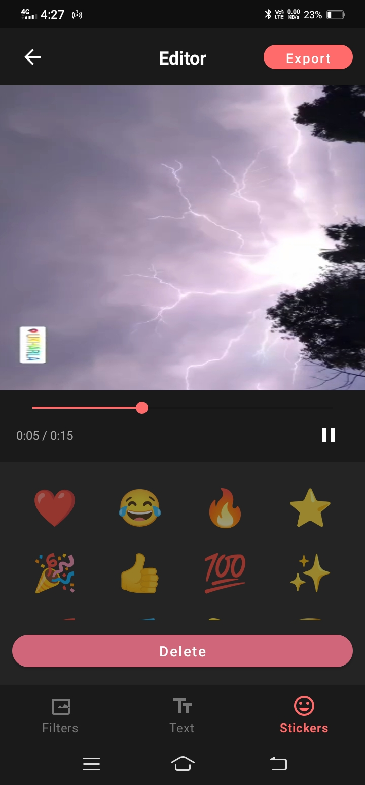

# VideoEditor

A powerful, customizable, and easy-to-use Android Video Editing library. It allows you to play videos, apply real-time OpenGL filters, add interactive text and sticker overlays, and export the final merged video using MediaCodec.

## Installation

Add the JitPack repository in your `settings.gradle` (or `build.gradle` for older projects):

```gradle
dependencyResolutionManagement {
    repositoriesMode.set(RepositoriesMode.FAIL_ON_PROJECT_REPOS)
    repositories {
        google()
        mavenCentral()
        maven { url = uri("https://jitpack.io") }
    }
}
```

Add the dependency in your app's `build.gradle`:

```gradle
dependencies {
    implementation("com.github.Excelsior-Technologies-Community:VideoEditor:1.1")
}
```

*Replace `Tag` with the latest release version.*

## Key Components & Methods

The library provides several core components to integrate video editing seamlessly into your app.

### 1. `VideoPlayer`
A wrapper around `MediaPlayer` specifically tailored for video editing previews.

**Key Methods:**
- `prepare(uri: Uri, context: Context, surface: Surface)`: Initializes the player with a video file and an output surface (usually from `EditorGLSurfaceView`).
- `play()`: Starts or resumes video playback.
- `pause()`: Pauses video playback.
- `seekTo(ms: Long)`: Seeks to a specific timestamp in milliseconds.
- `release()`: Stops playback and releases media resources.

**Callbacks:**
- `onPrepared: (() -> Unit)?`: Triggered when the video is ready to play.
- `onCompletion: (() -> Unit)?`: Triggered when playback reaches the end.
- `onError: ((String) -> Unit)?`: Triggered on playback errors.
- `onProgressUpdate: ((Long, Long) -> Unit)?`: Triggered continuously to report `(currentPosition, duration)`.

### 2. `EditorGLSurfaceView`
A custom `GLSurfaceView` that renders the video frames and applies hardware-accelerated OpenGL shader filters.

**Key Properties:**
- `filterParams: FilterParams`: The current applied filter settings (brightness, contrast, saturation, filter layout). Update this property to change the filter in real-time.
- `onSurfaceReady: ((Surface) -> Unit)?`: Emits the `Surface` object to be passed into the `VideoPlayer`.

**Key Methods:**
- `setShaders(vertexSrc: String, fragmentSrc: String)`: Injects custom OpenGL shaders for custom video effects.

### 3. `OverlayCanvasView`
A custom view dedicated to drawing and managing interactive overlay elements like text and stickers on top of the video container. It supports gestures like dragging, scaling, and rotating.

**Key Methods:**
- `addOverlay(item: OverlayItem)`: Adds a new overlay to the canvas.
- `removeOverlay(id: String)`: Deletes an overlay by its unique ID.
- `getOverlays(): List<OverlayItem>`: Returns a snapshot of all active overlays.
- `clearSelection()`: Deselects the currently selected overlay.
- `selectedOverlay(): OverlayItem?`: Retrieves the currently focused overlay.

**Callbacks:**
- `onOverlaySelected: ((OverlayItem?) -> Unit)?`: Triggered when the user taps on or interacts with an overlay.

### 4. `OverlayItem`
A sealed class representing visual elements added via `OverlayCanvasView`.

- **`OverlayItem.TextOverlay`**: For adding stylized text. Properties include `text`, `textColor`, `fontSize`, `bold`, `hasShadow`, `bgColor`, `normX`, `normY`, `scale`, and `rotation`.
- **`OverlayItem.StickerOverlay`**: For adding image bitmaps. Properties include `bitmap`, `normX`, `normY`, `scale`, and `rotation`.

### 5. `FilterParams` & `FilterPreset`
Models controlling the visual GL adjustments to the video stream.

- **`FilterPreset`** Defaults included: `NONE`, `GRAYSCALE`, `SEPIA`, `VIVID`, `COOL`, `WARM`, `FADE`, `NOIR`.
- **`FilterParams`**: Customize via `brightness`, `contrast`, `saturation`, and `filterType`.

### 6. `VideoExporter`
The engine that renders the original video, applies the exact filter parameters, draws your overlays on the correct timestamps, and multiplexes everything into a new `.mp4` file.

**Key Methods:**
- `export(config: ExportConfig, onProgress: (Int) -> Unit)`: Starts the asynchronous rendering and writing process. Progress is reported from 0 to 100.

**`ExportConfig` properties:**
- `context`: Application or Activity Context.
- `videoUri`: Original source video URI.
- `outputFile`: Destination `File` where the final MP4 will be saved.
- `filterParams`: Filters to burn into the video.
- `overlays`: List of `OverlayItem` to print onto the video frames.
- `videoWidth` / `videoHeight`: Target resolution of the exported video.
- `videoDurationMs`: Total duration of the clip.
- 
## Screenshots

| Home Screen | Filters | Text Overlay | Stickers |
| :---: | :---: | :---: | :---: |
|  |  |  |  |

### Video Demo

